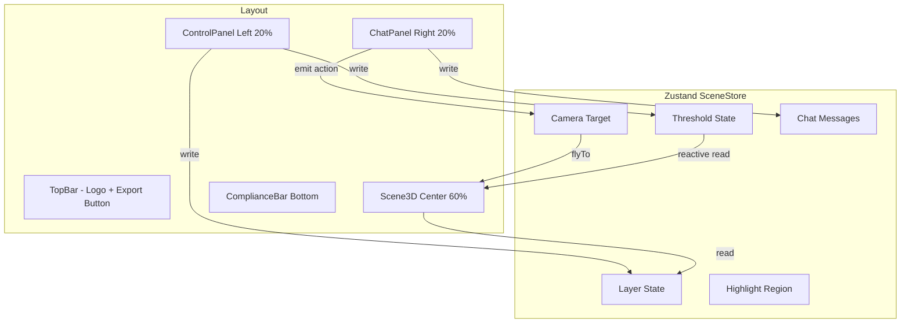

## 产品概述

异构群智数字孪生主控舱是一个面向极端地下环境（断网、无可见光）的3D数字孪生可视化商业SaaS平台前端MVP Demo。该产品专门服务于地下裂缝、夹层探测的特种机器人数据收集与可视化场景，通过3D渲染、热力图层、AI智能对话等手段为工程人员提供沉浸式的井下安全监控与决策支持体验。最终交付一个可直接运行的本地页面，所有数据按照PRD契约自行Mock生成。

## 核心功能

### 三栏工业风布局

- 左侧控制台（20%）：浮空式状态监控与参数调节面板
- 中央3D孪生视窗（60%）：全屏3D渲染画布，OrbitControls手势交互（左键旋转/右键平移/滚轮缩放）
- 右侧对话舱（20%）：浮空式LLM专家对话窗格，支持折叠拉伸
- 底部合规栏：固定免责声明横幅

### 中央3D画布

- 图层叠加切换：实体网格（平滑岩壁）、原始点云（稀疏雷达点）、瓦斯热力层（红蓝渐变雾化）、温度热力层（独立色谱）
- 超阈值区域"红色呼吸特效"警示
- POI空间锚点：特定坐标展示[!]图标，点击弹出瞬时环境数据气泡
- 右上角浮动相机XYZ坐标与缩放比例

### 左侧控制台

- 瓦斯报警红线滑块（0.5%-5.0%，默认1.5%），实时联动热力图重绘
- 数据置信度过滤滑块（0%-100%），动态降透明度"剥离AI脑补盲区"
- 一键体积测算：3D空间拖拽Bounding Box计算土方量
- 还原物理真实面貌：关闭所有AI润色层，仅显示单色雷达点云 + 居中水印

### 右侧AI对话舱

- 对话气泡流 + Markdown渲染
- 快捷指令Tag（评估塌方风险、预测瓦斯扩散等）
- 空间联动响应：发送指令后触发3D画布相机平滑飞行至目标区域并锁定高亮闪烁

### 数据与合规

- Mock生成至少10,000个节点，包含geometry（center/mesh_vertices/raw_points）、sensors（ch4/temperature/pressure）、confidence_score
- 深色工业风配色（Deep Charcoal），禁止大面积亮绿色，使用深灰深蓝冷色调表示常态
- 底部固定合规免责声明
- PDF导出含3D截图 + 参数快照 + JSON哈希值

## 技术栈选择

| 模块 | 技术 | 用途 |
| --- | --- | --- |
| 构建工具 | Vite 5 + TypeScript | 极速HMR开发体验，零配置启动 |
| UI框架 | React 18 | SPA组件化架构 |
| 组件库 | Shadcn UI + Radix UI | 可定制暗黑工业风组件，源码可控 |
| 样式 | Tailwind CSS 3 | 暗黑主题配色系统、响应式三栏布局 |
| 3D引擎 | Three.js + @react-three/fiber + @react-three/drei | 声明式3D场景，OrbitControls，点云/网格/热力图渲染 |
| 状态管理 | Zustand | 轻量级全局状态（图层/阈值/相机目标/对话消息） |
| Markdown | react-markdown + remark-gfm | AI对话消息Markdown渲染 |
| PDF导出 | jsPDF + html2canvas | 报告导出（截图+参数+哈希） |
| 图标 | lucide-react | 工业风图标系统 |


## 实现方案

### 3D渲染架构决策

**决策：使用 React Three Fiber（R3F）而非直接集成 Potree/Deck.gl**

理由：Potree是独立查看器，与React生态深度集成成本高且限制大；Deck.gl与R3F的Canvas共存需复杂桥接。在MVP阶段，使用Three.js原生能力即可完全满足10,000点级渲染需求：

- **点云渲染**：`BufferGeometry` + `Points` + 自定义`ShaderMaterial`，10K点在GPU端轻松处理
- **热力图**：基于传感器数据的着色器映射（瓦斯值→红蓝渐变，温度值→独立色谱），配合additive blending产生雾化效果
- **网格层**：程序化生成的隧道/裂缝表面几何体，带噪声纹理的岩石材质
- **呼吸特效**：Shader中基于`uTime` uniform和瓦斯阈值比较，动态调制超阈值点的opacity/size

**性能考虑**：10,000个顶点使用单个BufferGeometry + instanced rendering，避免逐帧重建。置信度过滤在顶点着色器中discard，避免CPU端过滤开销。

### Mock AI引擎

无LLM后端的情况下，构建本地Mock AI响应引擎：

- 预定义指令-响应对（快捷指令触发预设文本 + 空间动作事件）
- 指令解析器匹配关键词（"塌方"/"瓦斯"/"3号区"等）→ 返回结构化响应（文本 + `action: { type: 'flyTo', target: [x,y,z], region: 'zone-3' }`）
- 空间动作触发`useCameraFlyTo` hook执行GSAP-free的lerp相机动画 + 区域高亮闪烁

### 数据生成策略

模拟地下隧道/裂缝场景：

- 沿弯曲路径生成隧道点云（带噪声扰动模拟裂缝）
- 集中在特定区域生成瓦斯热点（高ch4浓度）和温度异常区
- 置信度分布：核心区域0.7-0.95，边缘区域0.2-0.6
- POI锚点设置在裂缝交汇处、瓦斯异常区、塌方风险点

## 实现注意事项

### 性能关键点

- 点云着色器中使用单个`BufferAttribute`合并position+color+confidence+sensor数据，减少draw call
- 热力图重绘时仅更新uniform（`uThreshold`, `uConfidence`, `uTime`），不重建geometry
- 相机坐标显示使用`useFrame`节流（每100ms采样一次），避免每帧触发React re-render
- Zustand状态按关注点切片，避免大范围re-render

### 视觉一致性

- 全局CSS变量定义Deep Charcoal配色体系，Tailwind扩展配置对齐
- Shadcn组件通过CSS变量覆盖实现工业风外观（荧光黄强调、圆角缩小、边框冷色调）
- 所有3D对象共享统一的坐标空间（PRD契约中的center坐标系）

### PDF导出注意

- 从`gl.domElement.toDataURL()`获取3D画布截图（需在render后同步调用）
- 参数快照从Zustand读取当前所有滑块值
- JSON哈希使用Web Crypto API的SHA-256
- 导出过程需用户等待反馈（loading状态）

## 架构设计



## 目录结构

全新项目，以下为完整目录规划：

```
/Volumes/HD/robot/
├── package.json                          # 依赖声明与scripts
├── vite.config.ts                        # Vite配置（@别名、GLSL插件）
├── tsconfig.json                         # TypeScript配置
├── tsconfig.node.json                    # Node环境TS配置
├── tailwind.config.ts                    # Tailwind暗黑工业风扩展
├── postcss.config.js                     # PostCSS配置
├── components.json                       # shadcn/ui配置
├── index.html                            # Vite入口HTML
├── src/
│   ├── main.tsx                          # React入口，挂载App
│   ├── App.tsx                           # 三栏布局组装 + 全局Provider
│   ├── index.css                         # 全局样式 + CSS变量配色体系
│   ├── types/
│   │   └── index.ts                      # Mock数据TypeScript类型定义（NodeData, Geometry, Sensors, POI, ChatMessage, SceneAction等）
│   ├── data/
│   │   ├── mockDataGenerator.ts          # 生成10,000+节点，模拟隧道/裂缝/瓦斯热点场景
│   │   └── poiData.ts                    # POI空间锚点定义（裂缝交汇、瓦斯异常、塌方风险点）
│   ├── store/
│   │   └── useSceneStore.ts              # Zustand全局状态：图层可见性、阈值、置信度、相机目标、高亮区域、对话消息、物理真实模式
│   ├── lib/
│   │   ├── utils.ts                      # cn() Tailwind类名合并工具
│   │   ├── mockAI.ts                     # Mock AI响应引擎：关键词解析→文本+空间动作事件
│   │   └── pdfExport.ts                  # PDF导出：截图+参数快照+SHA-256哈希
│   ├── hooks/
│   │   └── useCameraFlyTo.ts             # 相机平滑飞行动画（lerp-based tween）
│   ├── components/
│   │   ├── ui/                           # shadcn/ui组件（源码可控）
│   │   │   ├── slider.tsx                # 工业风滑块组件
│   │   │   ├── button.tsx                # 按钮组件
│   │   │   ├── card.tsx                  # 卡片容器
│   │   │   ├── badge.tsx                 # 状态徽章
│   │   │   ├── tooltip.tsx               # 悬浮提示
│   │   │   ├── separator.tsx             # 分割线
│   │   │   └── scroll-area.tsx           # 滚动区域
│   │   ├── layout/
│   │   │   ├── MainLayout.tsx            # [NEW] 三栏flex布局容器，响应式适配
│   │   │   ├── TopBar.tsx                # [NEW] 顶栏：产品Logo、系统状态指示、PDF导出按钮
│   │   │   └── ComplianceBar.tsx         # [NEW] 底部固定合规免责声明横幅
│   │   ├── scene/
│   │   │   ├── Scene3DCanvas.tsx         # [NEW] R3F Canvas容器，注册OrbitControls、灯光、各图层组件
│   │   │   ├── PointCloudLayer.tsx       # [NEW] 原始点云渲染：BufferGeometry+自定义Shader，支持置信度过滤discard
│   │   │   ├── MeshLayer.tsx             # [NEW] 程序化岩壁网格层：隧道曲面几何+岩石材质
│   │   │   ├── HeatmapLayer.tsx          # [NEW] 热力图层：瓦斯红蓝渐变 + 温度色谱，阈值呼吸特效
│   │   │   ├── POIMarkers.tsx            # [NEW] POI空间锚点：Html overlay标记 + 点击弹出气泡
│   │   │   ├── CameraInfo.tsx            # [NEW] 右上角浮动XYZ坐标与缩放比例（节流采样）
│   │   │   ├── HighlightRegion.tsx       # [NEW] AI触发的区域高亮闪烁效果（脉冲透明边框球体）
│   │   │   ├── VolumeMeasure.tsx         # [NEW] 3D体积测算工具：拖拽生成Bounding Box + 弹窗显示体积
│   │   │   └── WatermarkOverlay.tsx      # [NEW] 物理真实模式水印叠加层
│   │   ├── control-panel/
│   │   │   ├── ControlPanel.tsx          # [NEW] 左侧控制台容器，组装所有控制组件
│   │   │   ├── GasThresholdSlider.tsx    # [NEW] 瓦斯报警阈值滑块，联动热力图重绘
│   │   │   ├── ConfidenceSlider.tsx      # [NEW] 置信度过滤滑块，联动点云透明度
│   │   │   ├── LayerToggle.tsx           # [NEW] 图层开关组（Mesh/点云/瓦斯热力/温度热力）
│   │   │   └── ToolActions.tsx           # [NEW] 体积测算 + 物理真实面貌按钮组
│   │   └── chat/
│   │       ├── ChatPanel.tsx             # [NEW] 右侧对话舱容器，可折叠拉伸
│   │       ├── ChatMessage.tsx           # [NEW] 消息气泡组件，支持Markdown渲染
│   │       ├── ChatInput.tsx             # [NEW] 文本输入框 + 发送按钮
│   │       └── QuickCommands.tsx         # [NEW] 快捷指令Tag组（评估塌方风险、预测瓦斯扩散等）
│   └── shaders/
│       ├── pointCloud.vert.glsl          # 点云顶点着色器：置信度discard + 阈值变色
│       ├── pointCloud.frag.glsl          # 点云片元着色器：圆形点 + 发光效果
│       └── heatmap.frag.glsl             # 热力图着色器：红蓝渐变映射 + 呼吸脉冲
```

## 关键数据结构

```typescript
// Mock数据节点结构（严格遵循PRD契约）
interface SceneNode {
  node_id: string;
  timestamp: number;
  confidence_score: number;       // 0-1
  geometry: {
    center: Vec3;
    mesh_vertices: Vec3[];
    raw_points: (Vec3 & { intensity: number })[];
  };
  sensors: {
    ch4_concentration_pct: number;  // 0-5
    temperature_celsius: number;    // 10-60
    pressure_kpa: number;           // 80-130
  };
}

// Zustand Store 状态结构
interface SceneStore {
  // 图层
  layers: { mesh: boolean; pointCloud: boolean; gasHeatmap: boolean; tempHeatmap: boolean };
  // 参数
  gasThreshold: number;         // 0.5-5.0
  confidenceFilter: number;     // 0-100
  physicalTruthMode: boolean;
  // 空间联动
  cameraTarget: { position: Vec3; region?: string } | null;
  highlightRegion: { position: Vec3; radius: number; active: boolean } | null;
  // 对话
  messages: ChatMessage[];
  // 动作
  setLayer: (key: string, value: boolean) => void;
  flyTo: (target: Vec3, region?: string) => void;
  sendMessage: (text: string) => void;
  resetHighlight: () => void;
}

// Mock AI 空间动作事件
interface SceneAction {
  type: 'flyTo' | 'highlight' | 'toggleLayer';
  payload: {
    position?: [number, number, number];
    region?: string;
    layer?: string;
    message: string;   // AI回复文本
  };
}
```

## 设计风格

采用深色重工业控制台风格（Deep Charcoal Industrial），打造地下矿井指挥中心的沉浸式科技感。整体氛围沉稳冷峻，通过荧光黄高亮、警告红脉冲和冷色调深蓝灰营造专业可靠的工程安全管控气质。面板采用毛玻璃半透明效果浮空叠加在3D画布之上，形成层次分明的主控舱视觉体验。

## 布局设计

### 顶栏（TopBar）

- 左侧Logo + 产品名"异构群智数字孪生主控舱"，右侧系统时钟 + 在线状态指示灯 + [导出安监审查报告]按钮
- 高度48px，半透明深色背景 + 底部荧光黄细线分隔

### 左侧控制台（20%宽度）

- **系统状态监控卡片**：网络状态（离线模拟）、传感器连接数、数据吞吐量
- **图层控制区**：四组开关Toggle（实体网格/原始点云/瓦斯热力/温度热力），带图层图标和描述
- **瓦斯报警阈值**：荧光黄标签 + Slider滑块，实时数值显示，超阈值时标签变红脉冲
- **数据置信度过滤**：百分比滑块 + 进度条可视化，显示当前过滤掉的节点数
- **物理实验工具箱**：两个大按钮（一键体积测算 / 还原物理真实面貌），带图标

### 中央3D视窗（60%宽度）

- 全屏Three.js画布，深色星空背景渐变
- 左上角：迷你指南针 + 当前区域名称
- 右上角：相机坐标HUD（X/Y/Z + Zoom%），半透明卡片
- 右下角：图层透明度快捷调节
- 3D场景：程序化隧道/裂缝点云，可旋转/平移/缩放，热力图叠加，POI锚点标记

### 右侧AI对话舱（20%宽度）

- 顶部：[井下AI助理]标题栏 + 折叠按钮
- 快捷指令区：4-6个Tag按钮（评估塌方风险/预测瓦斯扩散/切换3号区视角/显示高置信区域等）
- 对话流：AI消息（左侧深蓝灰气泡）+ 用户消息（右侧荧光黄暗色气泡），Markdown渲染
- 底部：输入框 + 发送按钮，支持Enter发送

### 底部合规栏

- 固定48px高度，深红警告色细条背景
- 居中免责声明文本："本系统基于受限条件感知融合，所有3D建模与参数预测仅作工程参考，绝对禁止作为下井作业的唯一安全决策依据。"
- 左侧[!]警告图标脉冲

### 交互与动画

- 面板hover时毛玻璃透明度降低（从0.85→0.95），边框微亮荧光黄
- 滑块拖动时热力图实时重绘，滑块手柄荧光黄发光
- AI指令触发时：相机平滑飞行（2秒缓动）+ 目标区域球状高亮脉冲闪烁（3次）
- 瓦斯超阈值区域：红色呼吸脉冲（opacity 0.3↔0.8，周期1.5秒）
- 物理真实模式：全屏灰色蒙版 + 居中半透明水印文字

## Agent Extensions

### Skill

- **dispatching-parallel-agents**
- Purpose: 并行开发3D场景层组件（PointCloud/Mesh/Heatmap）与控制面板组件，减少串行等待时间
- Expected outcome: 3D渲染层与UI控制层同步完成，减少约40%开发时间

### MCP

- **GitHub**
- Purpose: 项目完成后将代码推送到GitHub仓库并配置Vercel部署相关文件
- Expected outcome: 代码版本化管理和一键部署准备就绪